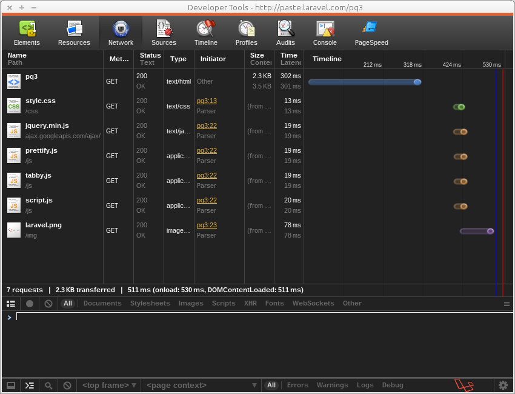
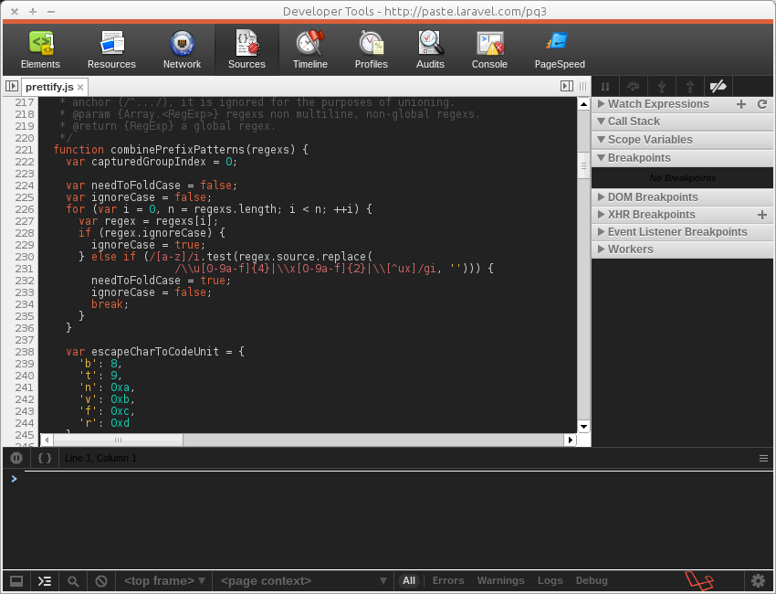

# mmmLaravel Theme
A not so minimal theme for the Chrome Developer Tools.  
Modifies Elements and Console view, other views are on the way.

Tested on Mac and Arch Linux

## Installation 
Just locate the `User Stylesheets` directory and override the `Custom.css`:

**Mac:** `~/Library/Application Support/Google/Chrome/Default/User StyleSheets/Custom.css`

**PC:** `C:\Users\YourUsername\AppData\Local\Google\Chrome\User Data\Default\User StyleSheets\Custom.css`

**Ubuntu (Google Chrome):** `~/.config/google-chrome/Default/User StyleSheets/Custom.css`

**Ubuntu (Chromium):** `~/.config/chromium/Default/User StyleSheets/Custom.css`

## Customization
Feel free to fork and customize the theme to your needs. Missing some selectors? Just navigate Chrome to `chrome-devtools://devtools/devTools.css` and get a detailed list of nearly all possible selectors and their default styles.

## Screenshots

